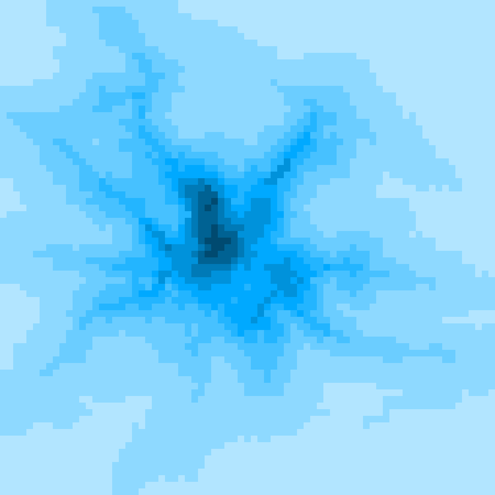
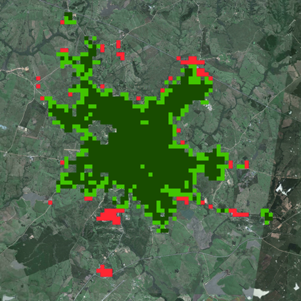

### MSC RESEARCH

This study was developed as part of my MSc dissertation, developed at the Federal University of Pelotas, Brazil, entitled “Urban Growth Simulation in Cellular Spaces with an Accessibility Measure”. The main aim of the MSc research was to explore dynamics of urban expansion in small and medium Southern Brazilian cities, influenced by natural and human-made features of the landscape surrounding the city. The urban growth simulation model presented here was developed as part of the research.

The model is based on two main ideas: location and distance. The idea of location comes the observation that some areas tend to develop different land uses according to their relative position in the region. This idea is not new, and has been developed since the 19th and early 20th centuries in the classic models of Von Thünen (1966) and Christaller (1966) in regional scale.

The second idea is that distances, in a geographic context, are not measured only in Euclidian terms. Distances are relative, and can be affected by the natural and human-made features of the environment. The quality of the transport infrastructure connecting places, as well as the availability of different modes of transport, can effectively shorten distances, so that areas far away in geometric terms can be relatively close when distances are measured in terms of time or cost of travel. The inverse is also true when the effects of natural barriers such as rivers, mountains or difficult to traverse terrains are considered, effectively increasing the relative distance between places. This interpretation of distances as friction is similar to the concept of Minimum Cumulative Resistance, or MCR, used in urban and environmental planning studies (Adriaensen 2003, Liu 2010).

An accessibility measure was adapted to cellular space to quantify the relative distances from the surrounding areas to the city, integrating the natural and urban environments into one spatial differentiation measure. This accessibility measure was then used in an urban growth model, which assumed that areas of high accessibility have a higher probability of being urbanised first. This idea was already indicated by Hansen in 1959 as a common assumption among urban planners, stating that “The more accessible an area is to the various activities in a community, the greater its growth potential.” (Hansen 1959, page 73).



  

    
  

  

    
  

  

    
  



Keywords: urban growth; accessibility; environment; urban modeling; computer simulation.

