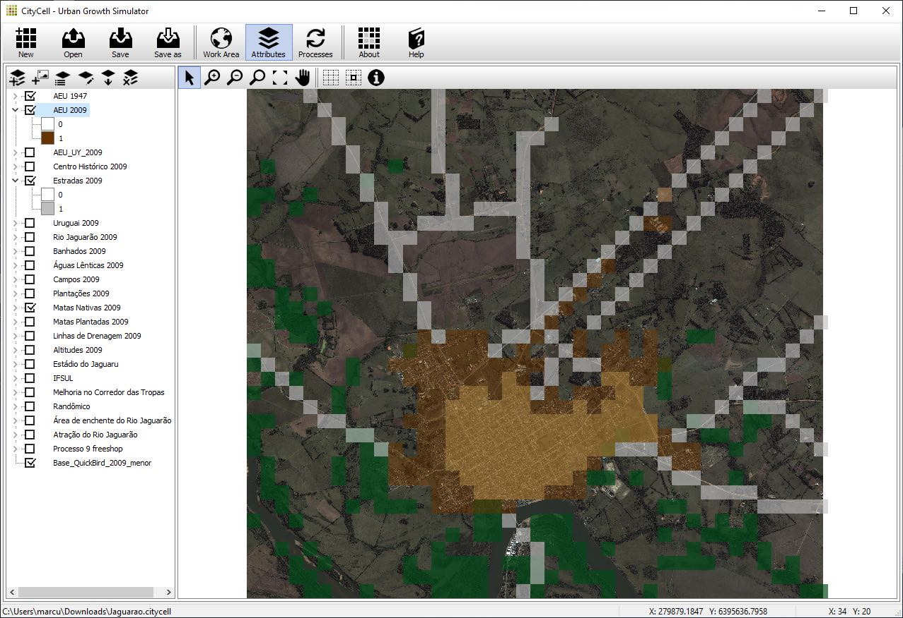

#### Software

CityCell is conceived as a framework containing the necessary tools for running urban growth simulation models in cellular spaces. The available models are called Rules, referring to the dynamic component of Cellular Automata. The software is built in Embarcadero Delphi.

#### Citation:

SARAIVA, Marcus Vinicius Pereira; POLIDORI, Maurício Couto (2014). _CityCell – Urban Growth Simulator (software)._ LabUrb – Laboratório de Urbanismo da FAUrb. Pelotas: UFPel.

#### **Models currently available (Rules):**

**Threshold Potential** and **Free Potential** (POLIDORI, 2004);\
**Threshold Reload** and **Free Reload** (POLIDORI, 2004);\
**Environmental Percolation** (POLIDORI, 2004);\
POLIDORI, Maurício Couto(2004). _Crescimento urbano e ambiente: um estudo exploratório sobre as transformações e o futuro da cidade._ Tese de Doutorado UFRGS PPGECO. [S.l.], 352 p.

**WaterLand Factor** (PERES e POLIDORI, 2010);\
PERES, Otavio Martins (2010). _Crescimento urbano e hidrografia: dinâmicas morfológicas e articulação à paisagem natural._ Dissertação de Mestrado UFPel PROGRAU. [S.l.], 132 p.

**Periurban Growth** (TORALLES e POLIDORI; 2013).\
TORALLES, Christiano Piccioni (2013). _Cidade e crescimento periférico: morfologia e modelagem da formação do tecido urbano._ Dissertação de Mestrado UFPel PROGRAU. Pelotas.

**Environmental Accessibility** (SARAIVA e POLIDORI, 2013)\
SARAIVA, Marcus Vinicius Pereira (2013). _Simulação de crescimento urbano em espaços celulares com uma medida de acessibilidade: método e estudo de caso em cidades do sul do Rio Grande do Sul._ Dissertação de Mestrado UFPel – PROGRAU. Pelotas.

#### **Collaborators:**
Alexandre Pereira Santos\
Ana Paula Neto de Faria

#### **Antecedent:**
SACI – Simulador do Ambiente da Cidade
POLIDORI, Maurício Couto, GRANERO, Juliano Chaves (2004). _SACI – Simulador do Ambiente da Cidade® (software)._ Componente da Tese de Doutorado em Ecologia de Maurício Couto Polidori. Porto Alegre: UFRGS – PPGECO.
Keywords: urban growth; accessibility; environment; urban modeling; computer simulation.

#### More Information

CityCell can be downloaded from its website, mantained by the Laboratory of Urbanism of the Federal University of Pelotas.
[website](https://wp.ufpel.edu.br/citycell)

