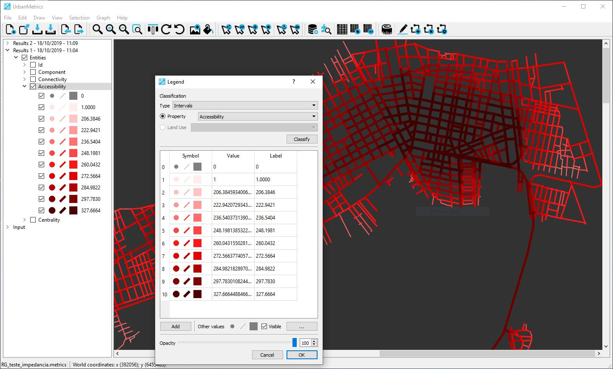

#### Software

The UrbanMetrics software implements a series of models originally conceived by Professor Romulo Krafta, aiming to intraurban spatial analysis based on urban morphology and on the relationship between city and society. The software is built using C++ and Qt Creator.

UrbanMetrics is developed by the team of the Laboratory of Urbanism of the Faculty of Architeture and Urbanism of the Federal University of Pelotas (LabUrb, FAUrb, UFPel) and implements centrality, accessibility and connectivity metrics.

#### Team 

The current team is the following:

Maurício Polidori — coordinator\
Marcus Saraiva — software developer\
Otavio Peres — collaborator\
Romulo Krafta — author of the original idea\

Other collaborators:

Ana Paula Faria — collaborator\
Ana Paula Zechlinski — collaborator\
Eduardo Rocha — collaborator\
Miguel Polidori – web development

#### More Information

UrbanMetrics can be downloaded from its website, mantained by the Laboratory of Urbanism of the Federal University of Pelotas.
[website](https://wp.ufpel.edu.br/urbanmetrics)

